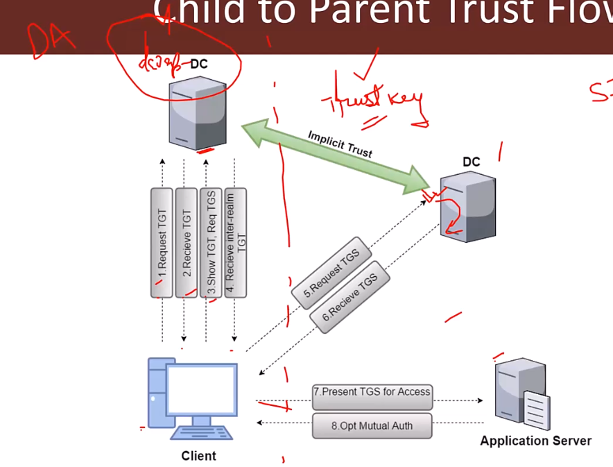

# Concepts

## [PowerShell Remoting](concepts.md#powershell-remoting)

* PSRemoting is like psexec but on steroids but more silent and super fast
* Uses WinRM (Windows Remote Management) which listens by default on 5985 (HTTP) and 5986 (HTTPS). WinRM is Microsoft's implementation of WS-Management
* **Enabled by default on Server 2012 onwards with a firewall exception.**
* **It is recommended way to manage windows Core servers.**
* You may need to enable remoting (`Enable-PSRemoting`) on a Desktop Windows machine, **Admin privs are required to do that.**
* **The remoting process runs as a high integrity process. That is, you get an elevated shell.**
* When a One-to-One PSSession is created:
  * It is an Interactive session
  * When the shell is spawned, it is `wsmprovhost` is executed and not powershell.exe
    * We can confirm this by executing `Get-PSHostProcessInfo`


## [Kerberos](concepts.md#kerberos)

* Clients (Programs on behalf of the user) need to obtain tickets from Key Distribution Centre (KDC) which is a service running on the domain controller. These tickets represent the client's credentials.
*

    <figure><figcaption></figcaption></figure>
* Step 1: The Client on behalf of the user sends an authentication request (AS-REQ) to the KDC, This is an timestamp encrypted with the user's NTLM/AES hash. Then the DC/KDC checks for clock-skew (default is 5mins skew is allowed) and other details, if everything looks good.
* Step 2: The KDC then responds (AS-REP) to this with a TGT (Ticket Granting Ticket), that is encrypted/signed with krbtgt secrets (NTLM/AES hash).
* Step 3: The client then presents this TGT to the DC and requests (TGS-REQ) for a TGS (Ticket Granting Service)
* Step 4: The DC responds with the TGS (TGS-REP)
* Step 5: The user then presents this TGS to the Service (Application Server in this case) and gets access to it.

## [Kerberos Double Hop Problem](concepts.md#kerberos-double-hop-problem)

* Kerberos Delegation allows to "reuse the end-user credentials to access resources hosted on a different server".
* This is typically useful in multi-tier service or applications where Kerberos Double Hop is required.
* For example, users authenticates to a web server and web server makes requests to a database server. The web server can request access to resources (all or some resources depending on the type of delegation) on the database server as the user and not as the web server's service account.
* Please note that, for the above example, the service account for web service must be trusted for delegation to be able to make requests as a user.
* Let's say we have three hosts: Attack host --> DEV01 --> DC01. Our Attack Host is a Parrot box within the corporate network but not joined to the domain. We obtain a set of credentials for a domain user and find that they are part of the Remote Management Users group on DEV01. We want to use PowerView to enumerate the domain, which requires communication with the Domain Controller, DC01.
*

    <figure><figcaption></figcaption></figure>
* When we connect to DEV01 using a tool such as evil-winrm, we connect with network authentication, so our credentials are not stored in memory and, therefore, will not be present on the system to authenticate to other resources on behalf of our user. When we load a tool such as PowerView and attempt to query Active Directory, Kerberos has no way of telling the DC that our user can access resources in the domain. This happens because the user's Kerberos TGT (Ticket Granting Ticket) ticket is not sent to the remote session; therefore, the user has no way to prove their identity, and commands will no longer be run in this user's context. In other words, when authenticating to the target host, the user's ticket-granting service (TGS) ticket is sent to the remote service, which allows command execution, but the user's TGT ticket is not sent. When the user attempts to access subsequent resources in the domain, their TGT will not be present in the request, so the remote service will have no way to prove that the authentication attempt is valid, and we will be denied access to the remote service.
* If unconstrained delegation is enabled on a server, it is likely we won't face the "Double Hop" problem. In this scenario, when a user sends their TGS ticket to access the target server, their TGT ticket will be sent along with the request. The target server now has the user's TGT ticket in memory and can use it to request a TGS ticket on their behalf on the next host they are attempting to access. In other words, the account's TGT ticket is cached, which has the ability to sign TGS tickets and grant remote access. Generally speaking, if you land on a box with unconstrained delegation, you already won and aren't worrying about this anyways.

### **Work Around:**

* 
  ```powershell
  ### Workaround 1
  *Evil-WinRM* PS C:\Users\backupadm\Documents> $SecPassword = ConvertTo-SecureString '!qazXSW@' -AsPlainText -Force
  *Evil-WinRM* PS C:\Users\backupadm\Documents>  $Cred = New-Object System.Management.Automation.PSCredential('INLANEFREIGHT\backupadm', $SecPassword)
  *Evil-WinRM* PS C:\Users\backupadm\Documents> get-domainuser -spn -credential $Cred | select samaccountname

  ### Workaround 2
  PS C:\htb> Register-PSSessionConfiguration -Name backupadmsess -RunAsCredential inlanefreight\backupadm
  Restart-Service WinRM
  PS C:\htb> Enter-PSSession -ComputerName DEV01 -Credential INLANEFREIGHT\backupadm -ConfigurationName  backupadmsess
  [DEV01]: PS C:\Users\Public> get-domainuser -spn | select samaccountname
  ```
  
* Note: We cannot use Register-PSSessionConfiguration from an evil-winrm shell because we won't be able to get the credentials popup. Furthermore, if we try to run this by first setting up a PSCredential object and then attempting to run the command by passing credentials like -RunAsCredential $Cred, we will get an error because we can only use RunAs from an elevated PowerShell terminal. Therefore, this method will not work via an evil-winrm session as it requires GUI access and a proper PowerShell console. Furthermore, in our testing, we could not get this method to work from PowerShell on a Parrot or Ubuntu attack host due to certain limitations on how PowerShell on Linux works with Kerberos credentials. This method is still highly effective if we are testing from a Windows attack host and have a set of credentials or compromise a host and can connect via RDP to use it as a "jump host" to mount further attacks against hosts in the environment.
* Other Solutions:
  * CredSSP
  * Port forwarding
  * Injecting into a process running in the context of a target user (sacrificial process)
  * Explicit credentials - Mention the credentials of the user explicitly
  * Delegation - [delegations.md](../../privilege-escalation/domain-privilege-escalation/delegations.md "mention")

## [Kerberos Delegation](concepts.md#kerberos-delegation)

* A user provides credentials to the Domain Controller.
* The DC returns a TGT.
* The user requests a TGS for the web service on Web Server. - At the end of this step the DC checks if the web server has unconstrained delegation or not, only if the web server has unconstrained delegation the DC will encapsulate the user's TGT inside the TGS and then return to the user.
* The DC provides the TGS to the user which is encapsulated with the user's TGT (since the web server has unconstrained delegation access).
* The user sends this TGS (encapsulated with user's TGT) to the web server. - Here the webserver would get the TGS which is encapsulated with the user's TGT as well.
* The web server service account use the user's TGT to request a TGS for the database server from the DC.
* The web server service account connects to the database server as the user.
*

    <figure><figcaption></figcaption></figure>

***

## [Trust Flow - Inter-realm TGT](concepts.md#trust-flow-inter-realm-tgt)

<figure><figcaption></figcaption></figure>

1. Client on behalf of the user send an encrypted (with user's AES Keys) timestamp to the DC (maybe child DC) - AS-REQ
2. DC (Child DC) then validates it and responds with a TGT - AS-REP
3. Then when the machine requests for a TGS i.e, SPN of a different domain (Domain B/Parent Domain)&#x20;
4. **Since the DC (Child DC) can't issue it directly, it'll respond with something called as Inter-realm TGT encrypted with a trust key i.e, since the DC (Child DC) doesn't have direct access to service (SPN) that is requested by the machine and if the SPN is in it's realm (trust zone) then it'll issue the Inter-realm TGT encrypted with a Trust Key**
5. <mark style="color:red;">Then machine sends this Inter-realm TGT to the other domain (Domain B/Parent DC)</mark>
   1. <mark style="color:red;">Here the DC only checks if it can decrypt the Inter-realm TGT with the Trust key it has, so if an attacker can craft an inter-realm TGT with the trust key, they can request TGS for any service on the forest.</mark>
6. Then machine then receives the requested TGS

***

## [Active Directory Certificate Services (AD CS)](concepts.md#active-directory-certificate-services-a-d-cs)

* Active Directory Certificate Services (AD CS) enables use of Public Key Infrastructure (PKI) in active directory forest.
* AD CS helps in authenticating users and machines, encrypting and signing documents, filesystem, emails and more.
* "AD CS is the Server Role that allows you to build a public key infrastructure (PKI) and provide public key cryptography, digital certificates, and digital signature capabilities for your organization."

### Components

* CA - The certification authority that issues certificates. The server with AD CS role (DC or separate) is the CA.
* Certificate - Issued to a user or machine and can be used for authentication, encryption, signing etc.
* CSR - Certificate Signing Request made by a client to the CA to request a certificate.
* Certificate Template - Defines settings for a certificate. Contains information like - enrolment permissions, EKUs, expiry etc.
* EKU OlDs - Extended Key Usages Object Identifiers. These dictate the use of a certificate template (Client authentication, Smart Card Logon, SubCA etc.)

### Flow

<figure><figcaption></figcaption></figure>

Check out "Certified Pre-Owned" paper from SpectorOps for more attack vectors on Abusing AD CS


